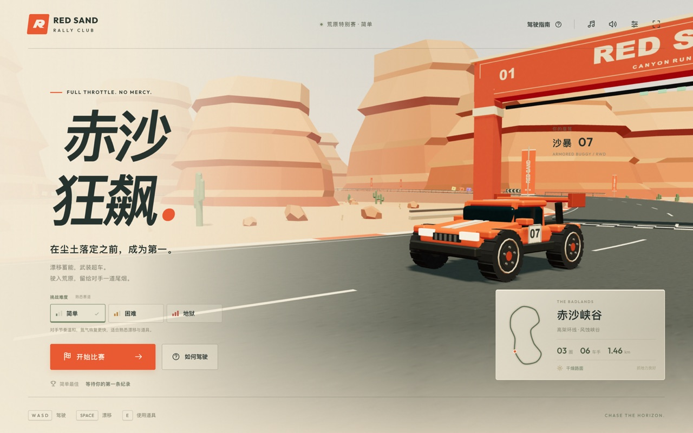
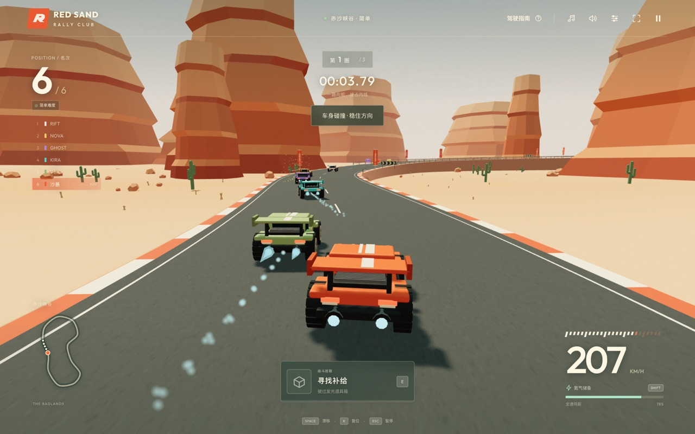

# 赤沙狂飙 · Red Sand Rally

一款可以直接在浏览器里玩的 **3D 战斗赛车**。橙红峡谷、装甲赛车、追尾镜头，六辆车跑三圈。超车可以靠技术，也可以靠刚捡到的火箭。

**TypeScript · Three.js · Vite · Web Audio · Playwright** — 无外部素材、无后端、无 API 密钥，全部内容程序生成。




---

## 目录

- [这是什么游戏](#这是什么游戏)
- [快速开始](#快速开始)
- [操作方式](#操作方式)
- [核心玩法](#核心玩法)
- [战斗与拾取](#战斗与拾取)
- [碰撞系统](#碰撞系统)
- [难度分级](#难度分级)
- [赛车皮肤](#赛车皮肤)
- [背景音乐](#背景音乐)
- [界面与交互](#界面与交互)
- [首版内容边界](#首版内容边界)
- [技术实现](#技术实现)
- [项目结构](#项目结构)
- [测试与验证](#测试与验证)
- [开发过程](#开发过程)

---

## 这是什么游戏

《赤沙狂飙》是一款单人街机风格的战斗赛车。在一条约 1.46 km 的起伏峡谷环线上，你和 5 名 AI 车手跑三圈决出胜负；赛道上散布着共享补给点，拾取火箭、地雷、护盾和氮气来争夺位置。

设计上希望同时满足两件事：

- **上手就能开**：加速、转向、漂移三步进入比赛，不需要记忆复杂按键。
- **一直有决策**：道具可以立刻用掉，也可以靠漂移蓄能升级后再用；什么时候出手是每一圈都要做的选择。

## 快速开始

需要 **Node.js 20.19+ 或 22.12+**，以及支持 **WebGL 2** 的现代浏览器。建议电脑横屏游玩，手机和平板也提供多指触屏按钮。

```sh
npm install
npm run dev
```

打开终端显示的地址，默认是 <http://localhost:5173>。

生产构建：

```sh
npm run build     # tsc --noEmit && vite build
npm run preview   # 本地预览构建产物
```

构建产物在 `dist/`，可以交给任意静态网站服务托管。注意不能通过双击 `index.html` 的 `file://` 方式运行，浏览器会因 ES Modules 的同源策略拦截。

## 操作方式

| 按键 | 操作 |
| --- | --- |
| `W` / `↑` | 加速 |
| `S` / `↓` | 刹车；停下后继续按住可倒车 |
| `A` `D` / `←` `→` | 转向 |
| `Space` + 转向 | 漂移；小喷就绪后松开触发出弯加速，持有道具时同时蓄能 |
| `Shift` | 消耗能量进行氮气冲刺 |
| `E` | 使用已拾取的道具 |
| `R` | 复位到赛道，保留比赛进度 |
| `Esc` / `P` | 暂停 / 继续 |

触屏设备会在屏幕上生成虚拟按键，支持多指同时操作（例如一边转向一边漂移）。倒计时、漂移和道具提示跟随当前输入方式切换，触屏道具按钮显示实际持有物及强化状态。切换到其他窗口或标签页会自动暂停。

## 核心玩法

- **赛道**：一条约 1.46 km 的闭合峡谷环线，包含高差、发卡弯、开阔直道和贴沙路段；赛道两侧有实体护栏，开放路段不设隐形墙，冲出路面会被沙地减速。
- **比赛**：六名车手、三圈决胜，发车倒计时后开始。玩家冲线即结算，其余未完成者按当时进度列为「未冲线」。
- **漂移**：按住漂移键并转向进入漂移，可维持更快的过弯速度；松开一次有效漂移还会得到短促的出弯加速。
- **漂移蓄能**：持有道具时持续漂移可以给道具充能，蓄满（阈值 99%）后下一次使用会变成强化版本。这是本作把「驾驶」和「战斗」连起来的主要设计。
- **漂移反馈**：独立的小喷进度条在有效漂移超过 0.5 秒时提示「小喷就绪」，松开后确认「出弯小喷」。道具强化进度单独显示，无道具时不会再显示「蓄能 0%」。就绪、强化、释放使用不同的短音效。
- **高速转向**：普通转向在 45–84 m/s 区间平滑衰减至 80%，松键与反打时更快回正；低中速、倒车和漂移保留原转向幅度。三档难度使用同一套转向规则。
- **氮气**：独立于道具的能量条，按 `Shift` 消耗并冲刺；能量会随时间被动回复，也可通过拾取氮气道具补充。地狱难度下被动回复更慢。
- **反馈**：实时名次、圈数、圈速、小地图、速度表、战斗提示与命中反馈。

## 战斗与拾取

赛道上有 **18 个共享补给点**，拾取后定时刷新（冷却 7.5 秒），玩家和 AI 抢同一批资源。每次只能持有一个道具。

| 道具 | 作用 | 蓄能强化后 |
| --- | --- | --- |
| **追踪火箭** | 自动锁定前方 220 米内最近的车，飞行速度 125 | 速度提升至 148，追踪更紧，存续更久 |
| **感应地雷** | 投向身后赛道，封锁后车路线 | 布设更靠后、存续更久 |
| **能量护盾** | 抵挡一次攻击，护盾 5.3 秒 | 持续时间延长到 8.5 秒 |
| **氮气喷射** | 立即冲刺 1.8 秒并回复 14 点能量 | 冲刺 3.2 秒并回复 28 点能量 |

受击会短暂失速并侧滑，随后获得一段保护时间，避免被连续命中。掉落赛道可以按 `R` 复位，保留比赛进度。

持有火箭时，HUD 显示实际锁定目标与距离，并在目标处于画面内时绘制标记；锁定不代表火箭能穿过实体障碍。敌方火箭接近时，独立预警区根据距离、速度和追踪路线提示来袭方位；持有护盾会显示使用提示，保护即将到期时仍会报警。预警不被普通拾取消息覆盖，命中对手使用独立的确认提示与音效。暂停、重开及火箭消失后会同步清理相应提示。

AI 对手同样遵守这套规则：必须自己开到补给点拾取道具、使用有限的氮气（可见氮气尾焰），不会凭空获得弹药或传送式追赶。

## 碰撞系统

车辆使用**随车头转向的有高度碰撞体**，两个旋转凸多面体通过 SAT（分离轴定理）检测接触，支持斜向擦碰、追尾、横向推挤、减速与轻微反弹。接触点会产生火花、碰撞音效和轻微镜头震动。

- 可见护栏、起点门柱、旗杆、明显岩石和仙人掌主干拥有实体碰撞；火箭也会被实体障碍挡住。
- 固定物理小步长配合多轮接触求解，限制高速穿透；静态障碍使用空间网格加速查询。
- 护盾和受击保护只防武器，**不会让车身穿透障碍**；撞住之后可以倒车脱困。

需要说明的是：这是一套有高度判定的街机碰撞，不是可翻滚、腾空的完整刚体模拟器。

## 难度分级

发车按钮上方可以选择 **简单 / 困难 / 地狱**，默认简单。三档使用**相同的玩家转向、加速度、最高速度、武器与碰撞体积**，差距来自对手强度和失误代价，而不是界面标签：

| | 简单 | 困难 | 地狱 |
| --- | --- | --- | --- |
| 对手速度 | 保留原版手感 | 更高、决策更快 | 进一步提速，弯道更敢跑 |
| 战斗积极性 | 相对温和 | 更积极抢道具与进攻 | 追击与进攻最积极 |
| 玩家氮气回复 | 较快 | 标准 | 更慢 |
| 受击保护 | 较长 | 标准 | 更短 |

即使在地狱档，通过真实拾取、漂移蓄能和氮气配合仍然可以夺冠；护盾、复位和防连续命中的保护窗口始终保留。

所选难度在发车后锁定，暂停或重开会沿用，返回大厅可重新选择。选择保存在本机，**最佳纪录按难度独立保存**；旧版个人纪录仅在简单档回退读取，不会混入困难或地狱，也不会删除旧数据。浏览器禁止存储时游戏仍可正常进行。

## 赛车皮肤

大厅提供六款直接可用的「沙暴 07」涂装，点选即可在真实 3D 赛车上预览：

| 皮肤 | 外观 |
| --- | --- |
| 赤沙经典 | 赤橙车身、奶油双线 |
| 午夜电光 | 深石墨金属漆、青蓝偏置线 |
| 极地冰川 | 冰白车身、深蓝箭纹 |
| 霓虹脉冲 | 紫色车身、洋红分区撞色 |
| 毒液竞速 | 酸绿哑光漆、炭黑电路纹 |
| 熔岩余烬 | 深红金属漆、暖金斜纹 |

车漆、轮毂饰色、贴花和氮气尾焰随所选皮肤变化；号码 07、车体尺寸、碰撞、操控、速度和 AI 对手保持不变。皮肤缩略图和车体图案使用同一套程序化绘制，无需外部素材。

选择自动保存在本机（`sand-rally-skin-v1`），刷新、切换难度、重开与返回大厅都会保留。发车后不能通过大厅更换皮肤；返回大厅即可换装。存储被禁用或空间不足时，本次换肤仍有效，界面会提示未能保存，不影响原有纪录。

## 背景音乐

内置原创电子器乐 **《Dustline · 荒原电台》**：132 BPM、32 小节循环，包含主题旋律、回应段、低音区间奏和回归段，用温暖和弦、模拟合成器、低音与鼓组营造公路竞速感。不依赖外部曲库或音频下载，由 `music-score.ts` 中的乐谱数据驱动 Web Audio 实时合成。

- 菜单播放较轻的和弦与旋律；比赛按节拍加入低音和鼓组；氮气冲刺叠加琶音与更密的踩镲。
- 遵守浏览器自动播放限制：需要用户点击页面或按键后才启用声音。
- 右上角音符按钮打开「赤沙电台」，可以单独关闭音乐，并分别调整音乐与引擎/道具音效音量；设置自动保存在本机。
- 扬声器按钮是所有声音的总静音。默认音乐 40%、音效 80%；重要提示声出现时音乐短暂降低，随后平滑恢复。
- 暂停、离开窗口或隐藏页面时停止音乐调度，返回后不会叠加多条背景音轨，也不会补播积压音符。

## 界面与交互

- 界面参考 gpt-taste 的清晰排版、高对比按钮与分层过渡原则，按游戏需要采用全屏布局。
- 顶部工具栏：驾驶指南、音乐设置、总静音、精细/流畅画质切换、全屏。
- 主菜单展示完整 3D 场景、赛道预览（形状、圈数、车手数、长度、路面）与当前难度说明。
- 底部保留常驻操作提示；小屏幕横屏会自动调整布局，避免遮挡驾驶视野。

## 首版内容边界

**已包含**：一条完整赛道、玩家赛车与 5 名 AI、六款可保存的车身皮肤、四种道具与蓄能强化、体积碰撞、三档难度、原创配乐与音效、完整比赛流程（发车倒计时 → 实时名次 → 暂停 → 结算 → 重开 → 分档纪录）。

**暂不包含**：联机对战、开放世界、车辆性能改装、可破坏地形、独立跳台与捷径路线。

## 技术实现

- **渲染**：Three.js。峡谷地形、赛道设施、赛车模型、贴花与粒子全部程序生成，没有外部模型或贴图文件。
- **仿真**：固定小步长、可重复随机种子的比赛逻辑，与渲染解耦，因此单元测试可以直接跑完整场比赛。
- **难度**：三档难度的元数据与真实均衡参数集中在 `difficulty.ts`，界面与仿真共用同一份定义。
- **碰撞**：手写 SAT 接触检测 + 静态空间网格，见 `collision.ts`。
- **音频**：原生 Web Audio 实时合成音乐与音效，`music-score.ts` 存乐谱、`music.ts` 负责调度与合成乐器。
- **输入**：键盘与多指触控统一事件层，含失焦保护。
- **构建**：Vite；字体打包在本地，运行游戏无需远程图片、音频服务或 API 密钥。

## 项目结构

```text
src/
  main.ts          菜单、HUD、比赛流程与模块协调
  style.css        全屏界面与响应式触控布局
  simulation.ts    固定小步长、可重复随机种子的比赛逻辑
  driving.ts       高速转向衰减、松键与反打平滑
  race-feedback.ts 小喷/强化进度、锁定目标与火箭风险预测
  feedback-hud.ts  比赛内短时提示、方位预警与目标标记
  difficulty.ts    三档难度的共享元数据与真实均衡参数
  progress.ts      难度偏好、分档最佳纪录与旧数据兼容
  skins.ts         六款皮肤目录、外观参数与独立偏好存储
  car-skin.ts      程序化涂装绘制与车模资源回收
  skin-picker.ts   大厅皮肤选项与共用图案缩略图
  collision.ts     旋转凸碰撞体、SAT 接触检测与静态空间网格
  track.ts         赛道曲线、弧长采样和小地图坐标
  world.ts         峡谷、赛道设施、程序生成赛车
  renderer.ts      追尾镜头、拾取物、武器和粒子渲染
  input.ts         键盘、多指触控、失焦保护
  audio.ts         音乐/音效混音、音效合成和偏好持久化
  music.ts         动态音乐调度、合成乐器及空间效果
  music-score.ts   原创 32 小节旋律、和声、低音和琶音乐谱
  icons.ts         界面图标
  types.ts         各模块之间的数据契约
tests/
  simulation.test.ts           驾驶、圈数、计时、复位与比赛稳定性
  driving.test.ts              高速短按修线、低速/漂移保留与跨难度一致性
  race-feedback.test.ts        小喷/强化分离、目标选择、火箭轨迹与环线接缝
  feedback-hud.test.ts         提示生命周期、保护到期与小喷确认
  audio-feedback.test.ts       反馈音色、限频、暂停/静音和资源清理
  difficulty.test.ts           三档数值差异与真实胜负可达成性
  progress.test.ts             难度偏好、分档纪录与旧数据兼容
  skins.test.ts                皮肤数据、容错保存与比赛逻辑隔离
  car-skin.test.ts             车体边界、贴花/轮毂/尾焰与GPU资源释放
  collision.test.ts            旋转碰撞体与 SAT 接触检测
  collision-simulation.test.ts 高速防穿透、推挤与倒车脱困
  input.test.ts                键盘与多指触控生命周期
  music.test.ts                乐谱结构、调度与混音规则
  game.spec.ts                 桌面端完整比赛流程（Playwright）
  difficulty-game.spec.ts      难度选择与分档纪录
  collision-game.spec.ts       真实场景撞击护栏与对手
  music-game.spec.ts           音频启用、设置面板与暂停行为
  feedback-game.spec.ts        漂移/战斗反馈、实际道具操作与触屏布局
  skins-game.spec.ts           实际换肤、刷新/重开保存、资源稳定与多屏预览
```

## 测试与验证

```sh
npm test          # 逻辑与音频单元测试
npm run test:e2e  # 浏览器端到端测试
npm run build     # 类型检查 + 生产构建
```

**单元测试（`tsx --test`）** 覆盖驾驶与物理边界、高速转向校准、小喷与道具强化独立进度、火箭锁定和来袭轨迹、反馈音效与生命周期、旋转体积碰撞、薄墙高速防穿透、推挤与倒车脱困、武器与蓄能阈值、圈数与结算、暂停与重开、难度均衡、进度持久化、输入生命周期和多指触控、乐谱结构与混音规则。

**端到端测试（Playwright）** 使用本机 Google Chrome 实际运行页面，检查桌面与移动布局、声音偏好、真实驾驶与漂移、道具拾取、`Esc` 暂停、结算与「再来一局」，并在真实场景中撞击左右护栏和对手车辆。失败截图与 trace 输出到 `test-results/`。若未安装 Chrome，可在 `playwright.config.ts` 中换成已安装的浏览器。

## 开发过程

这个项目从一张空白画布开始，采用 AI 协作的方式分阶段推进，每一步都回到浏览器里验证：

1. **驾驶与赛道** — 先跑通追尾镜头、赛道曲线和基础手感，确认「开起来舒服」再往上加内容。
2. **AI 与战斗** — 接入 5 名对手、四种道具和漂移蓄能，让比赛有攻防节奏。
3. **碰撞** — 从中心距离判定升级为随车头转向的体积碰撞，并给可见障碍补上实体。
4. **声音** — 接入原创配乐与合成音效，音乐随比赛状态变化。
5. **难度** — 加入简单/困难/地狱三档，并把分档纪录、选档界面一起补齐。
6. **驾驶反馈** — 分离小喷与道具强化提示、校准高速转向，加入锁定标记、火箭方位预警与独立命中反馈。
7. **车身皮肤** — 加入六款程序化涂装、实时预览和本机保存，换肤只替换玩家视觉资源，不触碰比赛逻辑。

每次新增功能都会补充对应的单元测试与浏览器测试；测试通过只验证明确的行为边界，主观手感仍应结合真人试玩校准。

---

如果这个项目对你有帮助，欢迎点个 Star。也欢迎提 Issue 说说你希望下一个道具有什么效果。
